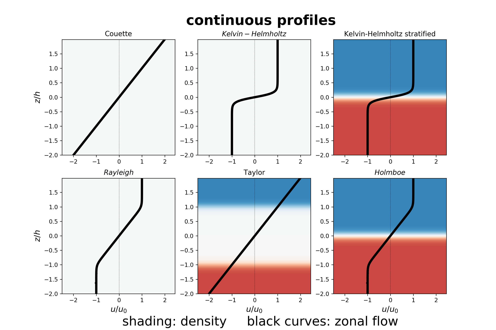

# Instabilities in Fluids - Semester 2, 2018, ANU

### Instructor: [Navid C. Constantinou][]

---

This repository contains notes and material for the class "Instabilities in Fluids" (EMSC3050/EMSC4050/EMSC8014) taught in 2018 at the Australian National University.

The main subject of the class is hydrodynamic instabilities. It is aimed to provide with the students both analytical and numerical skills to attack problems in hydrodynamic stability and also understand the underlying physical mechanisms responsible for those instabilities.

The first 2-3 lectures consist a gentle stroll through the Kelvin-Helmholtz instability, a manifestation of which is seen in the clouds over Mount Duval, NSW below:

 By <a href="https://en.wikipedia.org/wiki/User:GRAHAMUK" class="extiw" title="en:User:GRAHAMUK">GRAHAMUK</a> at the <a href="https://en.wikipedia.org/wiki/" class="extiw" title="w:">English language Wikipedia</a>, <a href="http://creativecommons.org/licenses/by-sa/3.0/" title="Creative Commons Attribution-Share Alike 3.0">CC BY-SA 3.0</a>, <a href="https://commons.wikimedia.org/w/index.php?curid=575598">Link</a>

Then each student will undertake a 2-week project with a theme from a list (to be finalized). The students will present their findings in the rest of the class. Throughout the course each student will do three projects.

## Some project examples

A few example of proposed projects include:

### Classical instabilities

Stability analysis of classical textbook hydrodynamic instabilities with basic states that consist of a flow **u**(x, y, z) = (U(z), 0, 0)  and density ρ(x, y, z) = ρ(z), like:

### Rayleigh-Benard Convection

[Courtesy of the Institute of Theoretical Physics, WWU Münster]

### Extra-tropical cyclones

[Courtesy of NOAA / GOES / NASA]

## Lecture Notes

1. [Intro to Stability Theory](http://nbviewer.jupyter.org/format/slides/github/navidcy/Instabilities-in-Fluids/blob/master/lectures/01-BasicsHydrodynamicStability.ipynb#/)
2. [Hydrodynamic Stability: Parrallel stratified shear flows](http://nbviewer.jupyter.org/format/slides/github/navidcy/Instabilities-in-Fluids/blob/master/lectures/02-BoussinesqEqs-InviscidStabilityParallellFlows.ipynb#/)
3. [Kelvin-Helmholtz instability: analytical study](http://nbviewer.jupyter.org/format/slides/github/navidcy/Instabilities-in-Fluids/blob/master/lectures/03-KH-unstratified-analytical.ipynb#/)
4. [Kelvin-Helmholtz instability: numerical study](http://nbviewer.jupyter.org/format/slides/github/navidcy/Instabilities-in-Fluids/blob/master/lectures/04-KH-unstratified-numerical.ipynb#/)

## Proposed Projects

Below is a list for the first projects (final)

| # |   Theme      |  Reading |
|:-:|-------------|------|
| 1 |  Study of stratified Kelvin-Helmholtz profile: Analytical, numerical. Mechanistic interpretation through edge-wave interactions.  |  |
| 2 |  Study of Rayleigh's profile: Analytical, numerical. Mechanistic interpretation through edge-wave interactions.  |  |
| 3 |  Study of Taylor's profile: Analytical, numerical. Mechanistic interpretation through edge-wave interactions.    |  |
| 4 |  Study of Holmboe's profile: Analytical, numerical. Mechanistic interpretation through edge-wave interactions.   |  |
| 5 |  General instability criteria for parallel shear flows (stratified and unstratified): The Rayleigh criterion and the Miles & Howard criterion. | Drazin |
|   |  Geophysical fluid dynamics: baroclinic instability |  |
| 6 |  Eady's model of baroclinic instability | Drazin |
| 7 |  Phillips' model of baroclinic instability | Drazin |
| 8 |  Rayleigh–Bernard convection | Rayleigh's paper? |

Projects 1-4 are closely related to the unstratified Kelvin-Helmholtz instability we discussed in class. However, I'd like you to further understand the instabilities that rise through interaction of edge-waves (i.e., waves that "live" on the discontinuities of the velocity or density profiles).

Project 5 is for the more mathematically inclined. It involves more pen-and-paper work and proving theorems and less numerics (although I can suggest various numerical examples of stability that fall into this project).

Projects 6-7 are a first step in studying cyclogenesis in the mid-latidute atmospheres. These projects require to work with the, so-called, quasigeostrophic equations on a beta-plane. I can help you get a hold of those if you haven't been familiarized with them before.

Project 8 involves the classical Rayleigh-Benard convection instability (2D) for two horizontal plates (hot plate below; cold plate on top).

Next follows a (non-finalized) list for projects to come:

| # |   Theme      |  Reading |
|:-:|-------------|------|
| 8 | Study of the Couette profile: The illusive theorem by Squire. Transient perturbation growth of 2D and 3D perturbations. The Orr mechanism and the lift-up mechanism.  | Boyd 1983, Farrell & Ioannou 1993 |
| 9 | Transient perturbation growth in Rayleigh's profile.  | ?? |
| 10 | Transient perturbation growth in Taylor's profile.   | ?? |
| 11 | Generalized stability theory. Theorems and  bounds on perturbations growth for non-normal (unstratified) systems and connection to 'usual' notion of modal stability. | Farrell & Ioannou 1996, Schmid & Henningson 2012 |
| 12 |  Transient perturbation growth and optimal excitation of Eady's model. | Farrell ?? |
| 13 |  Transient perturbation growth and optimal excitation of the Phillips' model. | ?? |
| 14 |  Hydrodynamic stability without eigenvalues. Spectra & pseudospectra and subcritical transition to turbulence. | Trefethen et. al. 1993 |
| 15 |  From Rayleigh–Bernard to chaos: Lorenz’s butterfly effect | Lorenz 1963 |

Project 8 deals with the Couette profile. As we discussed briefly in class the Couette profile is *modally* stable but still it does show finite-time perturbation growth. This project will involves first the discussion of Squire's theorem (see Lecture 3). Then finding the analytic solutions for the initial value problem for 2D and 3D perturbations of the Couette profile. Lastly, some discussion of the relations of the energy evolution of 2D and 3D perturbations and the connection with Squire's theorem.

Projects 9 and 10 study the transient energy growth and optimal excitation (adjoints versus eigenmodes) of the classic piecewise profiles in projects 2 and 3. Similarly, projects 12 and 13 for the baroclinic instability problems studies in projects 6 and 7.

Project 11 studies generalized stability theory and theorems that involve bounds on perturbation growth for every time (not only at *t*-->infinity). Project 14 introduces the generalization of eigenvalues (i.e., notion of pseudospectra) and presents a scenario for transition from a laminar to a turbulent state without any form of modal instability.

Project 15 studies the classic paper by Lorenz in which he discovered chaos in a low-order truncated system of Rayleigh-Benard convection.

[Navid C. Constantinou]: http://www.navidconstantinou.com
